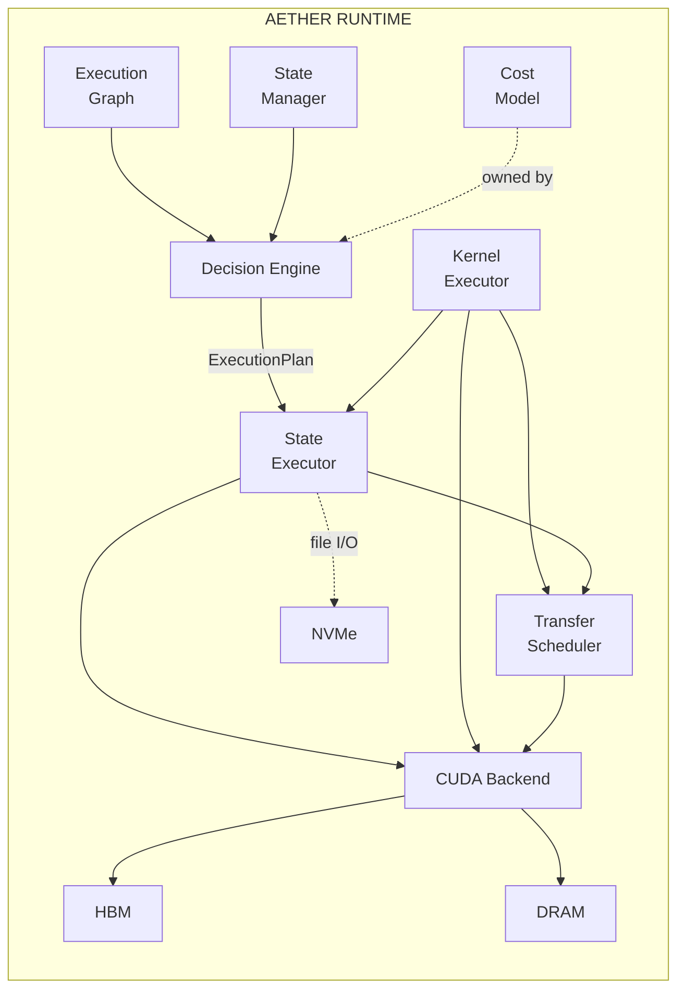
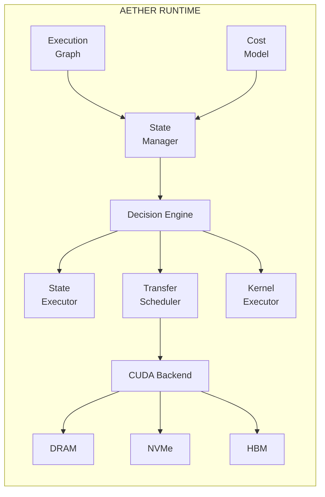

# Aether - State-Aware AI Execution Runtime

**Aether** is an AI execution runtime that jointly optimizes computation and state movement.
Unlike traditional runtimes that treat memory management as a subordinate cache subsystem,
Aether asks: *"What should happen next, and should the state be computed, moved, kept,
transformed, approximated, or discarded?"*

## Core Thesis

AI inference is increasingly constrained not by compute, but by moving large amounts of state:
- KV cache (growing with sequence length)
- Expert weights (MoE models with 100s of experts)
- Activations (checkpointing/recomputation tradeoffs)
- Model weights (when exceeding GPU memory)

Aether treats **decision** as the fundamental primitive, choosing between:
- **KEEP** - State stays where it is
- **MOVE** - Transfer to another memory tier
- **PREFETCH** - Speculatively fetch before needed
- **RECOMPUTE** - Regenerate instead of loading
- **APPROXIMATE** - Use lower-precision/compressed version
- **EVICT** - Remove from memory

## Architecture





## Crates

| Crate | Description |
|-------|-------------|
| `aether-core` | Core types, state management, decision engine, cost model |
| `aether-cuda` | CUDA memory management, async transfers, memory pools |
| `aether-kernels` | Compute kernels (attention, MLP, MoE, sampling) |
| `aether-bridge` | Integration layer connecting core logic with CUDA execution |
| `aether-bench` | Benchmarking harness for performance measurement |
| `aether-python` | Python bindings via PyO3 |

## Quick Start

### Rust

```rust
use aether_bridge::{UnifiedRuntime, RuntimeConfig};
use aether_core::{ExecutionState, StateType, Location};

// Create runtime
let config = RuntimeConfig::h100();
let runtime = UnifiedRuntime::new(config)?;

// Register states
let kv_cache = ExecutionState::kv_cache(
    0,      // id
    0,      // layer
    1,      // batch_size
    2048,   // seq_len
    32,     // num_kv_heads
    128,    // head_dim
);
runtime.state_manager().register(kv_cache)?;

// Plan and execute
let plan = runtime.plan()?;
runtime.execute().await?;
```

### Python

```python
import aether

# Create runtime
runtime = aether.Runtime.h100()

# Register KV cache state
kv_cache = aether.State.kv_cache(
    layer=0,
    size_bytes=128 * 1024 * 1024,
    shape=[1, 2048, 32, 128]
)
runtime.register_state(kv_cache)

# Plan execution
plan = runtime.plan()
print(f"Plan: {plan.summary()}")

# Execute
runtime.execute(plan)
```

## Benchmarking

Run the benchmark suite:

```bash
# All benchmarks
cargo run --release -p aether-bench -- all

# Transfer benchmarks only
cargo run --release -p aether-bench -- transfer

# Decision engine benchmarks
cargo run --release -p aether-bench -- decision

# Memory management benchmarks
cargo run --release -p aether-bench -- memory

# Output to file
cargo run --release -p aether-bench -- all -o results.md -f markdown
```

## Key Concepts

### Execution State

Everything generated or required during inference becomes a **state object**:

```rust
pub struct ExecutionState {
    pub id: StateId,
    pub state_type: StateType,      // KvCache, Activation, Weight, ExpertWeight, etc.
    pub location: Location,          // Hbm, Dram, Nvme, RemoteGpu, etc.
    pub size_bytes: u64,
    pub compute_cost_ms: Option<f64>, // Cost to recompute
    pub recomputable: bool,
    pub dependencies: Vec<StateId>,
    // ...
}
```

### Decision Engine

The decision engine evaluates each state against the execution graph:

```rust
let decision = engine.decide_for_state(&state, &graph, &constraints);
// Returns: Action::Keep | Action::Move | Action::Recompute | Action::Evict | ...
```

### Move vs. Recompute

Core tradeoff analysis:

```rust
let comparison = cost_model.compare_move_vs_recompute(&state, from, to);

if comparison.should_recompute {
    // Recomputing is faster/cheaper than loading
    Action::Recompute
} else {
    Action::Move
}
```

## Hardware Support

Aether is designed for heterogeneous memory systems:

| Tier | Typical Hardware | Bandwidth | Latency |
|------|------------------|-----------|---------|
| HBM | GPU Memory (H100: 80GB) | 3.35 TB/s | ~0.1 μs |
| DRAM | CPU Memory | 200 GB/s | ~0.1 μs |
| CXL | CXL Memory Expander | 64 GB/s | ~0.3 μs |
| NVMe | SSD Storage | 7 GB/s | ~10 μs |

Built-in presets:
- `HardwareConfig::h100()` - NVIDIA H100
- `HardwareConfig::a100()` - NVIDIA A100
- `HardwareConfig::rtx_4090()` - Consumer GPU

## Building

### Requirements

- Rust 1.70+
- CUDA Toolkit 12.0+ (optional, for GPU support)
- Python 3.8+ (for Python bindings)

### Build

```bash
# Core crates (no GPU required)
cargo build --release

# With CUDA support
cargo build --release --features cuda

# Python bindings
cd crates/aether-python
pip install maturin
maturin develop --release
```

## License

Apache-2.0

## Research Motivation

Aether emerged from the insight that modern AI inference runtimes (vLLM, TensorRT-LLM,
NVIDIA Dynamo) are converging on sophisticated memory management but still treat it as
subordinate to scheduling. The key question Aether asks is:

> Can an inference runtime jointly plan computation and state movement rather than
> treating memory management as a subordinate cache subsystem?

This leads to treating **compute-vs-move** as a first-class scheduling decision,
enabling optimizations like:

- Recomputing activations instead of loading from NVMe when faster
- Prefetching expert weights based on routing prediction
- Approximating states under memory pressure
- Cross-state optimization (e.g., cache activation vs. KV tradeoffs)
